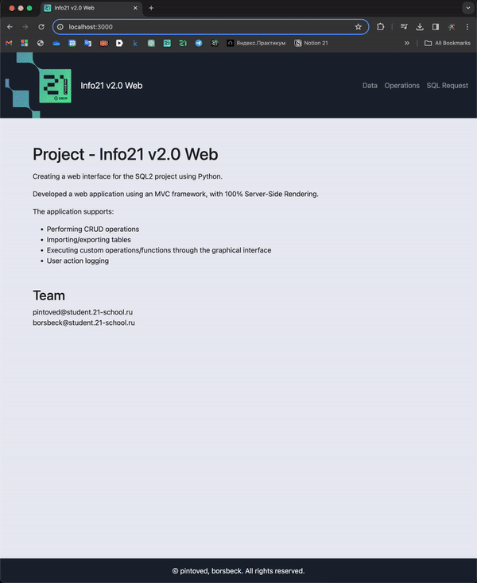

# Info21 v2.0 Web
# Web-interface for SQL2 Project




This project aims to create a web-interface for the SQL2 project using Python. The interface provides functionalities to interact with the SQL2 database, including performing CRUD operations, executing SQL queries, and displaying results. The implementation adheres to MVC architecture and Google Code Style guidelines.

## Technologies Used

- Python 3.11
- Fastapi
- React (Server-Side Rendering)
- SQLAlchemy, PostgresQL
- Docker
- Nginx

## How to Build the Project

1. Clone the repository to your local machine:

```
git clone <repository_url>
```

2. Navigate to the project directory:

```
cd <project_directory>/src
```

3. Up docker instance.

4. Run Docker containers:

```
docker-compose up
```

## How to Use the Interface

### Main Page

- The main page includes a navigation menu with access to *"Data"* and *"Operations"* sections.
- It also contains an *"About"* field with basic information about the student who completed the project.

### Data Section

- CRUD operations are supported for all tables.
- Upon any table modification, the application prompts the user for confirmation and displays the modified table.
- Import and export data to/from files with *.csv* extension.

### Operations Section

- Provides a list of possible queries from the SQL2 project.
- Allows users to enter SQL queries to manipulate database data.
- Supports executing procedures/functions/queries with result output and export options.
- Handles incorrect user inputs by displaying error messages.

## Logging

- Logging of all user actions is implemented.
- Log files are stored in the *logs* folder, with a new log file created daily.
- Logs indicate the level of importance: Info, Warning, Error.

## Bonus: Deployment

The application can be deployed using Docker containers:

- Database container
- Nginx container as a proxy server
- Web application container

Docker-compose is provided to run the entire application. Only the Nginx container is exposed to the outside.
